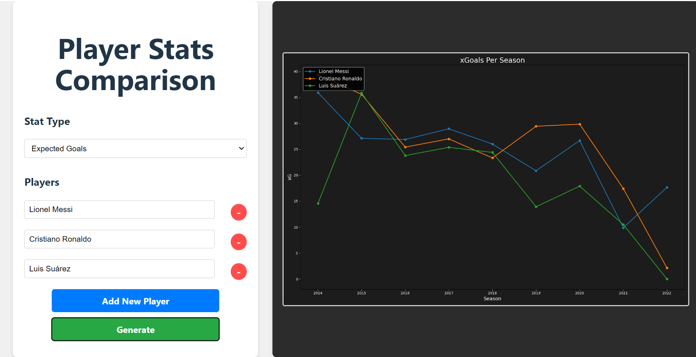

# PLAYER COMPARISON PLOTTER

- A web application that enables football(soccer) player comparison by plotting informative graphs.

## How to run this application
1. Install docker and docker-compose in your system if not installed already
2. Run the command:
```
docker-compose up
```
3. Enter http://localhost:3000 in your browser to view the web app.

## Example
Here, we have a screenshot of the web application in which the user compares the xG (Expected Goals) of soccer 
legends Lionel Messi, Cristiano Ronaldo and Luis Suarez over the years.

